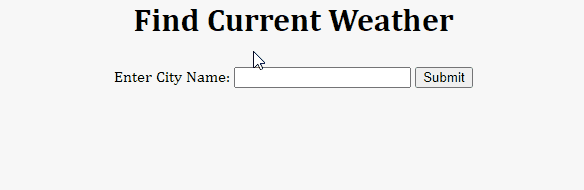

# APIWeatherData
This mini project is a Flask web application that uses the OpenWeatherMap API to retrieve and display the temperature of a city entered and gives error message if a wrong city name has been entered.

